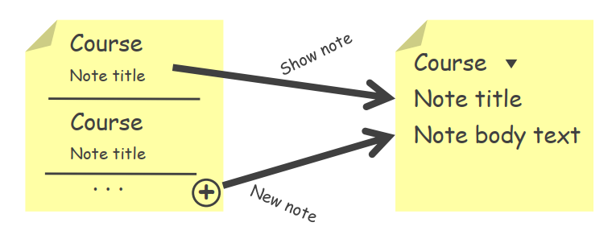

# NoteKeeper Sample Project

This app keeps notes on pluralsight courses.
The app performs the following fundamental tasks

- displays a list of notes
- edits existing notes
- creates new notes

A single note has 3 basic parts

1. The name of the course which must correspond to a pluralsight course
2. The title of the note as defined by the user
3. The contents of the note - long text entered by the user

## Long Term Plans

+ Automated testing of logic and UI/UX
+ Card-style lists
+ Slide-out drawer navigation
+ Track completed modules
+ Branding-based UI theme
+ Device and language adaptability
+ Support for users with accessibility needs - Android Talkback
+ User customisable behaviours
+ Use SQLite to store and access data
+ Make note data available to other apps
+ Display reminder notifications
+ Read and save data in the background
+ Display note information on homescreen using widgets

## Rough Design 

### Task 1

* Create editnote layout
* Add the courses, note title and note text fields
* Create note entries layout
* Each entry shows the course name and associated note title
* A tap on an entry will show the edit note screen
* A tap on the back button automatically saves thenote
* A tap on the cancel menu item discards user modifications and
    redirects the user to the nonte entries screen
* Users can tap on the next menu item to navigate to the next note
* In the note entries screen, the floating action button creates a new
    note and directs the user to the editnote screen
